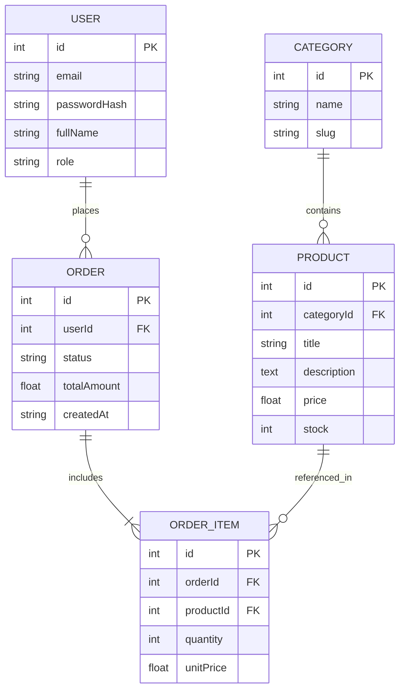

# Лабораторна робота №1
**Тема:** Початкова архітектура проєкту, ER-діаграма сутностей та налаштування HTTP-сервера  
**Дисципліна:** Технологія розробки Інтернет-застосунків  
**Виконала:** Студентка групи 3ПР1, Назенцева Катерина

---

## Опис предметної області
Розглядається система електронної комерції (інтернет-магазин).
- Користувачі (`USER`) оформлюють замовлення (`ORDER`).
- Товари (`PRODUCT`) розподілені за категоріями (`CATEGORY`).
- Замовлення містить кілька товарів, а товар може входити в різні замовлення — зв'язок $N:M$ реалізовано через проміжну сутність `ORDER_ITEM`, яка фіксує кількість та ціну одиниці товару на момент покупки.

---

## ER-діаграма сутностей (Mermaid)

